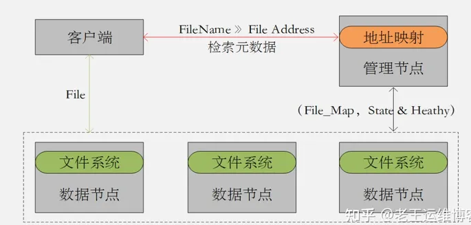

# GFS、HDFS：分布式储存系统

GFS和HDFS都是基于文件系统实现的分布式存储系统；

有中心的分布式架构 （图2.1） ；通过对中心节点元数据的索引查询得到数据地址空间，然后再去数据节点上查询数据本身的机制来完成数据的读写；都是基于文件数据存储场景设计的架构 ；都是**适合顺序写入顺序读取，对随机读写不友好。**

## GFS特性

1. GFS是一种**适合大文件**，尤其是GB级别的大文件存储场景的分布式存储系统。
2. GFS非常**适合对数据访问延迟不敏感**的搜索引擎服务。
3. GFS是一种有中心节点的分布式架构，Master节点是单一的集中管理节点，既是高可用的瓶颈，也是**可能出现性能问题的瓶颈**。
4. GFS可以通过缓存一部分Metadata到Client节点，减少Client与Master的交互。
5. GFS的Master节点上的Operation log和Checkpoint文件需要通过复制方式保留多个副本，来保障元数据以及中心管理功能的高可用性。

## HDFS特性

1. HDFS的默认最小存储单元为128M，比GFS的64M更大。
2. HDFS不支持文件并发写，对于单个文件它仅允许有一个写或者追加请求。
3. HDFS从2.0版本之后支持两个管理节点（NameNode），主备切换可以做到分钟级别。
4. HDFS 更适合单次写多次读的大文件流式读取的场景。
5. HDFS不支持对已写文件的更新操作，仅支持对它的追加操作。

