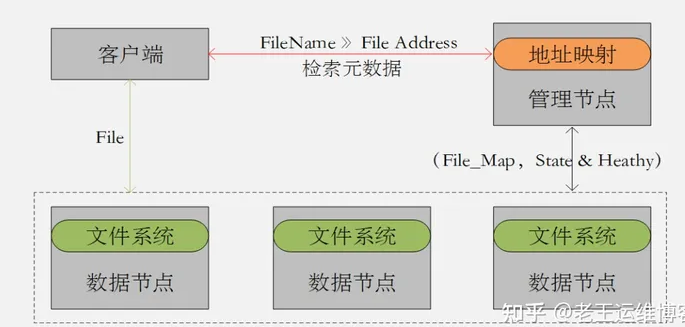

# GFS、HDFS：分布式存储系统

GFS（Google File System）与 HDFS（Hadoop Distributed File System）都是**面向大文件、顺序读写**的分布式文件系统，采用**主从（Master/NameNode + Chunk/DataNode）**架构。

## 架构对比

| 组件       | GFS         | HDFS                             |
| ---------- | ----------- | -------------------------------- |
| 元数据节点 | Master      | NameNode（Active/Standby）       |
| 数据节点   | ChunkServer | DataNode                         |
| 默认块大小 | 64 MB       | 128 MB（可配置）                 |
| 写模型     | 追加为主    | 一次写、多次读，**不支持随机改** |
| 并发写     | 单写者追加  | 单文件单写者                     |

## 共同特点

1. **适合大文件**：GB 级及以上，小文件元数据压力大
2. **顺序读写友好**：随机读写性能差
3. **有中心节点**：Master/NameNode 是元数据瓶颈与单点风险
4. **副本机制**：默认 3 副本，保证可靠性与读负载均衡

## GFS 读写概要

### 写（追加）

1. Client 向 Master 询问 chunk 副本位置
2. 数据沿流水线推送到各 ChunkServer
3. 以**追加**为主，保证高吞吐；随机覆盖写不友好

### 读

1. Client 从 Master 获取 chunk 位置缓存（可减少与 Master 交互）
2. 直接向 ChunkServer 读数据

### Master 高可用

- Operation Log + Checkpoint 多副本
- Master 故障影响元数据服务，是架构瓶颈

## HDFS 要点

1. **128 MB 块**：减少元数据量，适合流式读
2. **单写者**：同一文件同时只能有一个写或追加
3. **NameNode HA**（2.x+）：主备切换，分钟级；3.x 有更强 HA 方案
4. **仅追加**：已写文件不能原地更新，只能 append
5. **适合**：日志、离线批处理、Spark/MapReduce 输入

## GFS vs HDFS 选型理解

| 场景                 | 更合适                       |
| -------------------- | ---------------------------- |
| 搜索引擎、大数据离线 | HDFS 生态成熟                |
| 低延迟随机写         | 都不适合，用数据库或对象存储 |
| 海量小文件           | 需合并或使用 HBase、对象存储 |

## 面试一句话

> GFS/HDFS 都是主从架构、大块顺序读写、三副本；HDFS 块更大、单写多读、适合 Hadoop 生态；随机写和小文件都不友好。
